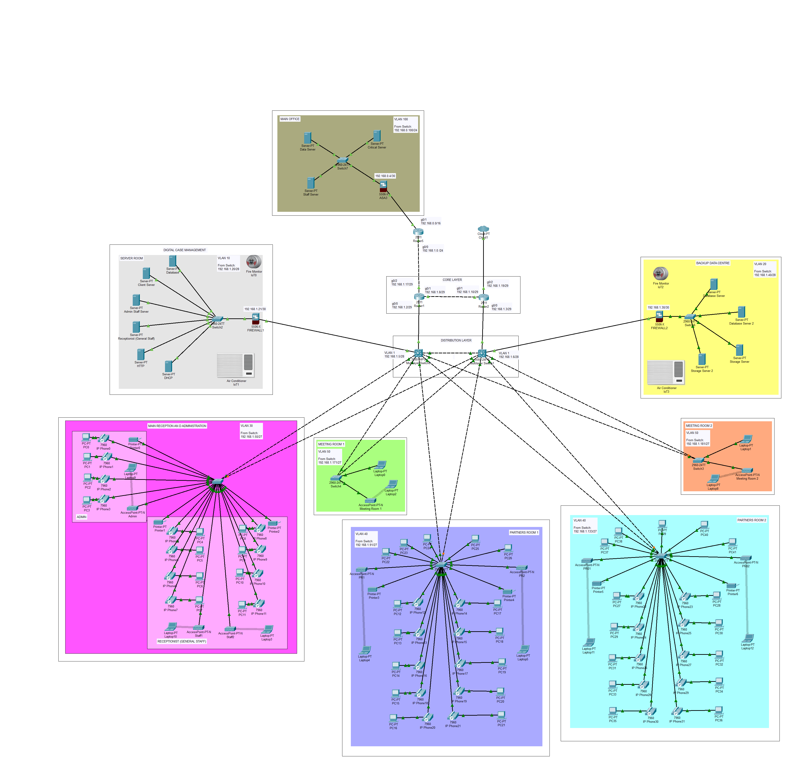

<h1 align="center">🌐 Network Infrastructure Design – Law Firm Branch in Bali</h1>

  <strong>University Assignment</strong> | <em>Network Design & Simulation</em>

  
  
  
  

---

<h2>📜 Project Overview</h2>

As a <strong>renowned network security consultant</strong>, we were tasked with designing the network infrastructure for a new branch office of a prominent law firm in <strong>Bali, Indonesia</strong>.  
The firm allocated the <code>192.168.1.0/24</code> subnet from their <code>192.168.0.0/16</code> IPv4 allocation for this branch.  
The design addresses both wired and wireless connectivity, interconnectivity with the main office, and disaster recovery preparedness.

<h2>📸 Preview</h2>

  

<h2>🎯 Objectives</h2>
<ul>
  <li>Propose appropriate network solutions.</li>
  <li>Justify networking technologies and design decisions.</li>
  <li>Demonstrate understanding of IP subnetting, topology, and interconnectivity.</li>
</ul>

<h2>🏢 Office Layout & Requirements</h2>
<ul>
  <li><strong>Main Reception & Administration</strong>: 10 ports for admin staff, 20 for general staff + Wi-Fi.</li>
  <li><strong>Partner Offices (x2)</strong>: 30 ports each + Wi-Fi.</li>
  <li><strong>Meeting Rooms (x2)</strong>: 2 ports each + Wi-Fi for up to 20 people.</li>
  <li>Seamless Wi-Fi roaming between areas.</li>
  <li>Legal staff: Full access to main office & branch resources.</li>
  <li>Client network: Limited resource access with security restrictions.</li>
  <li>Backup server location for disaster recovery.</li>
  <li>Self-hosted digital case management system integration.</li>
</ul>

<h2>🛠 Tools & Technologies</h2>
<ul>
  <li><strong>Simulation:</strong> Cisco Packet Tracer</li>
  <li><strong>Networking:</strong> VLAN, IP Subnetting, Routing Configuration</li>
  <li><strong>Security:</strong> Segmented networks, access control policies</li>
</ul>

<h2>📦 Key Deliverables</h2>
<ul>
  <li>📈 Network topology diagram</li>
  <li>📋 IP addressing table</li>
  <li>⚙ Routing configuration</li>
  <li>🔒 Security setup</li>
</ul>

<h2>🚀 Deployment</h2>

This project was <strong>deployed exclusively in Cisco Packet Tracer</strong> for simulation purposes.  
The design ensures readiness for physical implementation in a real-world environment.

---